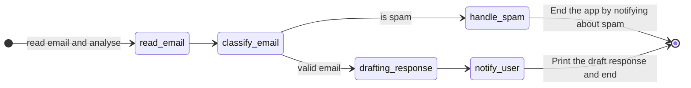

# Ollama Test
Examples of running ollama


To run ollama locally you need to download the ollama container.

create a `ollama_models` folder so you don't need to pull again the models 

- [Prepare ollama container](#prepare-ollama-container)
- [Prepare python](#prepare-python)

## Prepare ollama container
```sh
# Create container and mount the "ollama_models" folder
docker run -d -v $(pwd)/ollama_models:/root/.ollama -p 11434:11434 --name ollama ollama/ollama

# After create the container we need to connect to the container and run/download the models

# Execute it running the llama3.2
docker exec -it ollama ollama run llama3.2:1b
# Or Qwen Coder
docker exec -it ollama ollama run qwen2.5-coder:1.5b

# if the container is not running you can start with
docker container start ollama

# After download the models, we can run the python
python ./app/[Filename].py
```


## Prepare python

```sh
# Create virtual env
python -m venv myenv
# Activate virtual env
source ./myenv/bin/activate

# install packages. Check each file with the packages to install

# Deactivate/Exit of virtual env
deactivate
```


### Projects
- [Spam Email Checker](./apps/spam_checker.py)

- [Create Chat app](./apps/create_chat.py)
Run the model with a prompt to create a specific app
